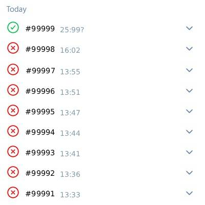
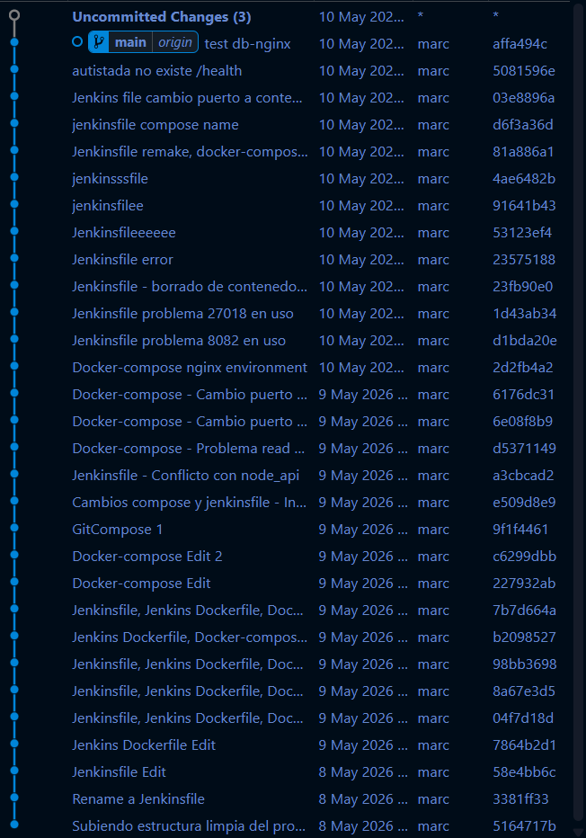

# Práctica Final Docker

*Marc Peñas Miró*

## 1. Levantar el entorno

1- git clone https://github.com/mpenasm/IsoFinal.git 
2- cd IsoFinal 
3- docker-compose -d --build 

## 2. Pipeline de Jenkins

### 2.1 Configuración inicial

- **agent any**: Le dice a Jenkins que puede ejecutar este trabajo en cualquier nodo o terminal disponible. 

- **environment**: Define una variable global. COMPOSE_PROJECT_NAME asegura que todos los contenedores pertenezcan al mismo grupo (proyectofinal12), evitando conflictos con otros proyectos. 

- **triggers**: Revisa GitHub cada 5 minutos. Si hay cambios nuevos, arranca el Pipeline automáticamente. Se podía poner en la configuración de la tarea en Jenkins.

### 2.2 Etapas

1. **Checkout**: Jenkins se conecta a tu repositorio de GitHub y descarga la última versión del código para trabajar con ella.

2. **Build**: Jenkins lee los Dockerfiles y construye las imágenes de Docker. Si hay un error de sintaxis en el código o falta alguna dependencia, el pipeline se detendrá aquí.

3. **Test**: Antes de lanzar la web al público, verificamos que funcione. Primero levanta solo la Base de Datos y la API y espera 10 segundos para que Node.js termine de arrancar. Después usa curl para preguntar al endpoint /health. Si responde bien el test pasa, si falla no llega a deploy.

4. **Deploy**: Si el test ha ido bien, se realiza el despliegue final. Aquí se levanta Nginx. --remove-orphans limpia cualquier contenedor antiguo que ya no necesitemos.

### 2.3 Cierre

- **always**: No importa si el pipeline terminó bien o mal, Jenkins ejecutará docker ps. Esto permite ver en la consola de Jenkins qué contenedores han quedado encendidos.

## 3. Decisiones tomadas

- Hacer una web nueva para empezar de 0.
- Meter Jenkins en un contenedor del compose para levantarlo todo de una.

## 4. Dificultades encontradas

- Permisos de Jenkins para los contenedores.
- Lío con los volumenes de nginx, algunas imagenes no se guardaban donde toca.
- Problemas con los puertos debido a contenedores locales.
- Al cambiar los puertos, las imagenes de los locales no se mostraban por su url + funcionamiento del server.js.
- Problemas cuando Jenkins levantaba contenedores, se duplicaban con otro nombre.

